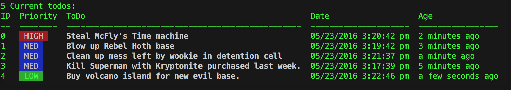

# CLI-Todo
A Simple command line todo list app. Written in javascript. Requires Node.js.



##Install
First install node.js. Go to nodejs.com for OS specific instructions.
```
npm install cli-todo -g
npm link
```
You will need to create the database file that CLI-Todo uses to store your todo items.
```
touch data/todoList.db
```
CLI-Todo uses the awesome NeDB javascript database. It's a flat file NoSQL database that uses a MongoDB API.
Check it out [here](https://github.com/louischatriot/nedb).

##Usage
```
td <command> [option]
```

##Examples
####Add a todo item
```
td -a "Kill Superman with Kryptonite purchased last week."
```
All items added to your todo list will get a priority of "Medium" by default.

To set a "High" or "Low" priority add the `-p <high|med|low>` option.
```
td -a "Kill Superman with Kryptonite purchased last week." -p "high"
```

####List all current open todo items
```
td -l
```

####Mark todo item as complete
```
td -c <todo ID>
```
First list your todo items (`td -l`). The id will be in the first column.

####Show completed todo items
```
td -s
```
